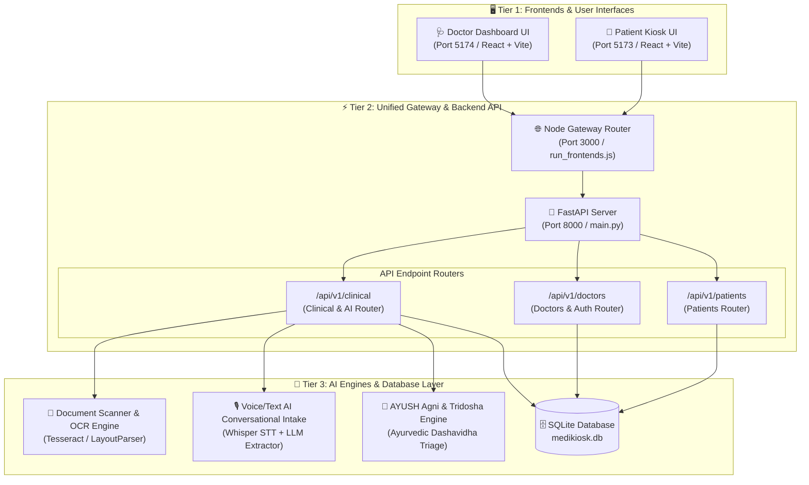
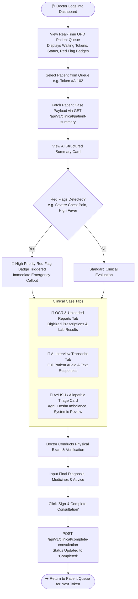
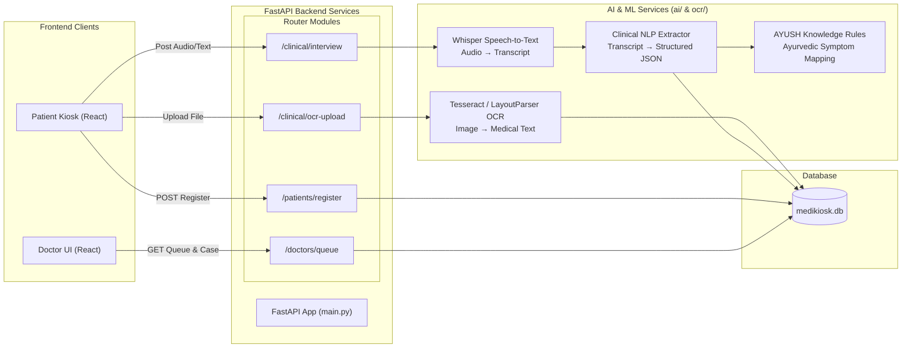
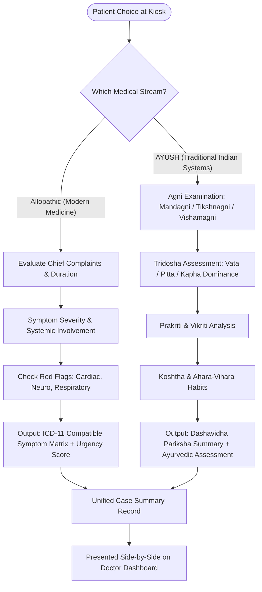

# 🏥 Smart Patient Intake & AI Case-Taking System
## 📊 End-to-End Architecture & Workflow Flowcharts (`FlowChartsreadme.md`)

> **Note for Faculty / Project Evaluators**: This document provides a complete, visual, and architectural walkthrough of the **Dual-Interface Smart Patient Kiosk & AI Clinical Decision Support System**. Use the Mermaid flowcharts and presentation guide below to explain the system end-to-end.

---

## 🎯 1. System Architecture Overview (High-Level Flow)

The system consists of three main tiers:
1. **Patient Kiosk Application** (`frontend/patient` on Port `5173`) – Multilingual, accessible, AI-powered intake kiosk for public health centers / OPDs.
2. **AI Engine & FastAPI Backend** (`backend` on Port `8000`) – Central orchestration server handling OCR scanning, Voice/Text STT, LLM clinical symptom extraction, and SQLite database persistent storage (`medikiosk.db`).
3. **Doctor Portal & Decision Dashboard** (`frontend/doctor` on Port `5174`) – Clinical workstation allowing doctors to view OPD queue, inspect AI-generated case summaries, review AYUSH/Allopathic triage, and issue signed consultations.



---

## 🔄 2. Patient Kiosk Complete Step-by-Step Flowchart

This flowchart details how a patient registers, selects their medical pathway (**Allopathic** vs **AYUSH**), scans physical medical records via OCR, completes an AI-guided voice interview, and receives a physical/digital OPD Token.

```mermaid
flowchart TD
    Start([🚀 Patient Approaches Kiosk]) --> Login[Step 1: Patient Identification / Quick Intake\nName, Age, Gender, Mobile/ABHA ID, Protocol Choice]
    
    Login --> BranchChoice{Selected Protocol?}
    BranchChoice -- "Modern Western Medicine" --> SetAllopathic[Protocol = Allopathic]
    BranchChoice -- "Traditional Medicine" --> SetAyush[Protocol = AYUSH / Ayurvedic]

    SetAllopathic --> LangSelect[Step 2: Language Selection\nEnglish, Hindi, Gujarati, Tamil, Marathi]
    SetAyush --> LangSelect

    LangSelect --> AccessConsent[Step 3: Accessibility Settings & Consent\nText Size, Voice Assist, ABHA Data Consent]

    AccessConsent --> DocUpload{Has Previous Medical Records / Reports?}
    
    DocUpload -- Yes --> OCRProcess[Step 4: Upload Document & Run OCR\nExtract Rx, Lab Values, Past Diagnosis]
    DocUpload -- No --> AIInterview
    
    OCRProcess --> StoreOCRSummary[Extract Text & Save to Case Context]
    StoreOCRSummary --> AIInterview

    AIInterview[Step 5: Interactive AI Clinical Case-Taking\nVoice & Text Multilingual Interview]

    AIInterview --> CheckMode{Protocol Mode?}
    
    CheckMode -- Allopathic --> AlloExtract[Extract Chief Complaint, Onset, Severity,\nAssociated Symptoms, Past History, Red Flags]
    CheckMode -- AYUSH --> AyushExtract[Extract Agni Status, Dosha Imbalance (Vata/Pitta/Kapha),\nKoshtha, Nadi, Ahara-Vihara Factors]

    AlloExtract --> GenSummary[Generate Structured Medical Case Summary]
    AyushExtract --> GenSummary

    GenSummary --> PrintToken[Step 6: Issue Token & Display Summary\nAssigned Token ID e.g. A-102, Department, QR Code]

    PrintToken --> EndKiosk([🏁 Patient Proceeds to OPD Waiting Area])
```

---

## 🩺 3. Doctor Dashboard & Clinical Decision Flowchart

This flowchart illustrates how doctors consume the AI case summaries, analyze red flags, view digitized OCR records, and complete the consultation.



---

## 🤖 4. Backend & AI Subsystem Technical Data Pipeline

This diagram shows how data moves between the Frontend, FastAPI endpoints, AI NLP models, Tesseract OCR, and SQLite Database.



---

## 🌿 5. AYUSH vs. Allopathic Dual Triage Logic Flowchart



---

## 🎓 6. Faculty Presentation Cheat Sheet & Key Highlights

When presenting this project to faculty or judges, use this quick reference guide to highlight the core innovations:

### 🌟 1. The Core Problem We Solve
- **Problem**: Overcrowded Hospital OPDs in India lead to long wait times, incomplete manual case history taking, and burden on doctors.
- **Our Solution**: An automated, intelligent **Patient Kiosk** that gathers patient history, scans past reports using OCR, performs AI voice intake in regional languages, and generates a structured summary for the doctor *before* the patient steps into the consultation room.

### 🚀 2. Key Architectural Innovations
1. **Dual Healthcare Support (Allopathic + AYUSH)**: First-of-its-kind intake kiosk supporting both modern Western medicine history taking and traditional Ayurvedic **Dashavidha / Agni / Tridosha** triage.
2. **Multilingual & Accessible**: Full support for voice-assisted intake across regional languages with adaptive text size and screen reader compatibility.
3. **Automated Document Digitization (OCR)**: Scans hand-written or printed doctor prescriptions/lab reports and feeds relevant medical history directly to the AI model.
4. **Emergency Red Flag Detection**: AI automatically flags critical conditions (e.g. chest pain, dyspnea) with visual alert badges on the doctor's queue screen.
5. **Seamless Offline / Fallback Resiliency**: Features built-in mock fallback handling ensuring the kiosk remains 100% operational even during internet or backend server dropouts.

### 🛠️ 3. Technology Stack Summary
- **Frontend**: React.js, Vite, Tailwind CSS, Lucide Icons.
- **Backend**: Python 3.10+, FastAPI, Uvicorn, SQLite (Pydantic & SQLAlchemy schemas).
- **AI & ML**: Tesseract OCR / PyTesseract, OpenAI Whisper (Speech-to-Text), Transformers / Rule-Based Clinical NLP Extractor.

---

*Document generated for project evaluation and presentation.*
