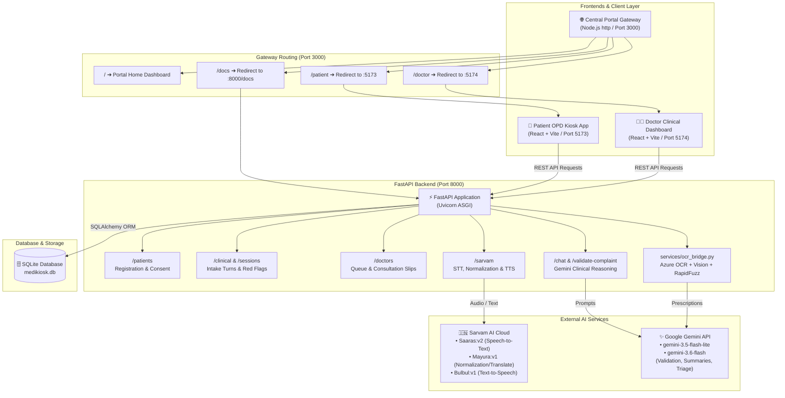
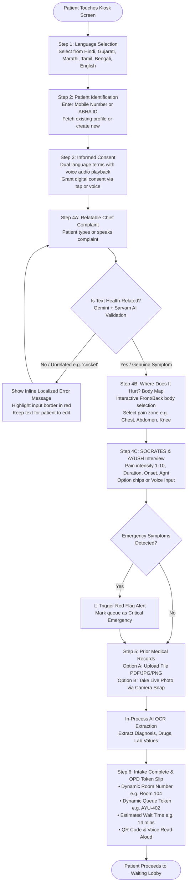
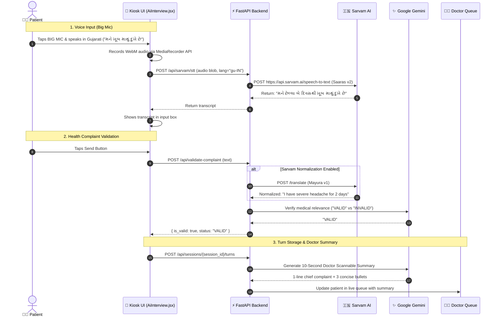
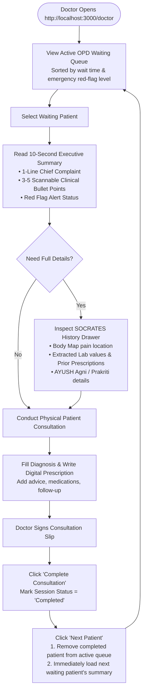

# 🏥 MediKiosk — AI Multilingual Clinical History-Taking & Triage Platform

> **Smart India Hackathon (SIH26047)**  
> **Problem Statement**: Automated Multimodal Patient Case-Taking Kiosk for Outpatient Departments (OPD)  
> **Target Institution**: All India Institute of Ayurveda (Ministry of Ayush) & Public Healthcare Centers  

[](https://opensource.org/licenses/MIT)
[](https://fastapi.tiangolo.com)
[](https://react.dev)
[](https://vitejs.dev)
[](https://ai.google.dev/)
[](https://www.sarvam.ai/)
[](https://www.sqlite.org/)

---

## 📌 Table of Contents
1. [Overview & Highlights](#-overview--highlights)
2. [Full System Flowcharts](#-full-system-flowcharts)
   - [System Architecture Flowchart](#1-system-architecture-flowchart)
   - [Patient Intake User Journey](#2-patient-intake-user-journey)
   - [Multimodal AI Voice & Text Pipeline](#3-multimodal-ai-voice--text-pipeline)
   - [Doctor Queue & Clinical Workflow](#4-doctor-queue--clinical-workflow)
3. [Technology Stack](#-technology-stack)
4. [Project Structure](#-project-structure)
5. [Prerequisites & Environment Setup](#-prerequisites--environment-setup)
6. [Step-by-Step Installation & Run Guide](#-step-by-step-installation--run-guide)
7. [API Endpoints Reference](#-api-endpoints-reference)
8. [Key Features Breakdown](#-key-features-breakdown)
9. [Troubleshooting & FAQs](#-troubleshooting--faqs)

---

## 🌟 Overview & Highlights

**MediKiosk** is a touch-screen and voice-enabled multimodal clinical history-taking platform designed for hospital OPD kiosks. It enables patients of diverse linguistic backgrounds (including illiterate and rural populations) to self-register, provide structured medical complaints via voice or touch, map their pain locations interactively, and digitize prior medical records before seeing a doctor.

### Core Capabilities
- 🗣️ **6 Indian Languages Supported**: Hindi, Gujarati, Marathi, Tamil, Bengali, and English with full dynamic localization.
- 🎙️ **Sarvam AI Indian Voice Layer**: Specialized regional Speech-to-Text (`saaras:v2`), dialect/Hinglish normalization (`mayura:v1`), and natural Indian-accented Text-to-Speech (`bulbul:v1`).
- 🤖 **Google Gemini Clinical Intelligence**: Medical complaint validation (blocks random non-health input like "cricket"), red-flag emergency detection, and instant 10-second doctor summaries.
- 🧍 **Interactive 2D/3D Body Pain Map**: Front/back body rotation with 13 anatomical regions (Head, Chest, Abdomen, Joints, etc.) and severity scoring.
- 📷 **Real-Time Camera Snap & Record Digitization**: Browser-based camera capture and document upload with OCR extraction and fuzzy drug name matching.
- 👨‍⚕️ **Doctor Clinical Dashboard**: Prioritized triage queue, 10-second rapid summaries, instant consultation slip generation, and dynamic queue advancement.

---

## 📊 Full System Flowcharts

### 1. System Architecture Flowchart



---

### 2. Patient Intake User Journey



---

### 3. Multimodal AI Voice & Text Pipeline



---

### 4. Doctor Queue & Clinical Workflow



---

## 💻 Technology Stack

| Layer | Technologies Used | Purpose |
| :--- | :--- | :--- |
| **Gateway & Portal** | Node.js, Express, Native HTTP | Multi-server routing gateway on port 3000 serving portal, `/patient`, `/doctor`, and `/docs` |
| **Patient Frontend** | React 19, Vite, Tailwind CSS v4, Lucide React, Axios | Touch-first, high-contrast, accessible multilingual kiosk interface |
| **Doctor Frontend** | React 19, Vite, Tailwind CSS v4, Lucide React, Axios | Scannable physician evaluation console, 10s summaries, queue management |
| **Backend API** | Python 3.10+, FastAPI, Uvicorn, Pydantic v2 | High-performance asynchronous REST API backend |
| **Database & ORM** | SQLite 3, SQLAlchemy 2.0 | Clinical database with auto-migration and demo data seeder |
| **Indian Voice & STT** | **Sarvam AI** (`saaras:v2`, `mayura:v1`, `bulbul:v1`) | Speech-to-Text, colloquial transliteration/normalization, and Indian-accented TTS |
| **Clinical Intelligence** | **Google Gemini** (`gemini-3.5-flash-lite`, `gemini-3.6-flash`) | Complaint validation, red-flag emergency detection, doctor summaries |
| **Document OCR** | Azure Document Intelligence, Gemini Vision, Pillow | Medical prescription and lab report digitization |
| **Pharma Matching** | RapidFuzz | Fuzzy drug-name string matching against official AYUSH & allopathic formulary |
| **Audio Processing** | HTML5 MediaRecorder, Web Speech API, Base64 Audio | Live microphone capture, real-time feedback, and natural voice playback |

---

## 📂 Project Structure

```
patient-case-taking/
├── backend/                        # FastAPI REST API Backend
│   ├── database/                   # SQLite database connection & seeders
│   │   ├── connection.py           # SQLAlchemy database engine
│   │   ├── seed_data.py            # Initial seed data script
│   │   └── medikiosk_schema.sql    # Raw SQL schema definition
│   ├── models/                     # SQLAlchemy ORM Models
│   │   ├── patient.py              # Patient profiles & ABHA records
│   │   ├── clinical_session.py     # OPD intake sessions
│   │   ├── interview_turn.py       # Q&A conversation logs
│   │   ├── red_flag_alert.py       # Emergency triage alerts
│   │   ├── medical_document.py     # Uploaded prescriptions
│   │   └── doctor.py               # Doctor profiles & credentials
│   ├── routers/                    # API Route Handlers
│   │   ├── patients.py             # Patient login, register, consent
│   │   ├── clinical.py             # Sessions, turns, tokens, triage
│   │   ├── doctors.py              # Doctor queue, active patients
│   │   ├── chat.py                 # Gemini complaint validation & summaries
│   │   └── sarvam.py               # Sarvam AI STT, Normalization, TTS
│   ├── services/                   # External AI & OCR Services
│   │   ├── sarvam_service.py       # Sarvam AI client (STT, Mayura, Bulbul)
│   │   └── ocr_bridge.py           # In-process prescription OCR pipeline
│   ├── main.py                     # FastAPI application entrypoint & CORS
│   └── requirements.txt            # Python dependencies
│
├── frontend/
│   ├── gateway/
│   │   └── portal.js               # Central Platform Gateway router (Port 3000)
│   ├── patient/                    # Patient OPD Kiosk SPA (Port 5173)
│   │   ├── src/
│   │   │   ├── components/steps/   # 6-Step Intake Flow
│   │   │   │   ├── LanguageSelect.jsx     # Step 1: 6 Language picker
│   │   │   │   ├── PatientLogin.jsx       # Step 2: ABHA / Mobile registration
│   │   │   │   ├── ConsentScreen.jsx      # Step 3: Biometric/Voice consent
│   │   │   │   ├── AiInterview.jsx        # Step 4: Big Mic & AI Q&A
│   │   │   │   ├── BodyMapStep.jsx        # Step 4 Add-on: 2D/3D Body Pain Map
│   │   │   │   ├── DocumentUpload.jsx     # Step 5: Camera Snap / File Upload
│   │   │   │   └── CaseSummaryToken.jsx   # Step 6: Dynamic Token Slip & QR
│   │   │   ├── context/PatientContext.jsx # Global Patient State Store
│   │   │   ├── services/api.js            # Axios client with Sarvam & Gemini
│   │   │   └── utils/speechUtils.js       # Sarvam TTS & Browser SpeechSynthesis
│   │   └── vite.config.js
│   │
│   └── doctor/                     # Doctor Clinical Dashboard SPA (Port 5174)
│       ├── src/
│       │   ├── components/
│       │   │   ├── PatientListPage.jsx    # Real-time waiting queue
│       │   │   └── PatientDetailPage.jsx  # 10s summaries, history, slip signing
│       │   ├── hooks/usePatientQueue.js   # Queue state & auto-advancement
│       │   └── api.js                     # Doctor API client
│       └── vite.config.js
│
├── package.json                    # Monorepo scripts & dependencies
├── run_frontends.js                # Monorepo development launcher
├── .env.example                    # Environment variable template
└── README.md                       # Comprehensive Documentation
```

---

## ⚙️ Prerequisites & Environment Setup

### 1. Prerequisites
- **Node.js**: v18.0.0 or higher ([Download](https://nodejs.org/))
- **Python**: v3.10.0 or higher ([Download](https://www.python.org/))
- **Git**: Installed and in PATH

### 2. Configure Environment Variables (`.env`)
Create a `.env` file in the root directory by copying `.env.example`:

```bash
cp .env.example .env
```

Edit `.env` and set your API keys:

```ini
# Database & Security
DATABASE_URL=sqlite:///./backend/medikiosk.db
SECRET_KEY=sih2026-secret-key-medikiosk-production

# Frontends & Gateway URLs
PATIENT_APP_URL=http://localhost:5173
DOCTOR_APP_URL=http://localhost:5174
PORT=3000

# Google Gemini API (Clinical Summaries & Validation)
GEMINI_API_KEY=your_google_gemini_api_key_here
GEMINI_MODEL=gemini-3.5-flash-lite

# Sarvam AI (Indian Regional Voice STT, Mayura Translation, Bulbul TTS)
SARVAM_API_KEY=your_sarvam_api_key_here
USE_SARVAM_AI=true
```

> [!TIP]
> **Resilient Fallback**: If `SARVAM_API_KEY` is not provided, the platform automatically falls back to browser Web Speech Recognition and native speech synthesis without breaking patient intake.

---

## 🚀 Step-by-Step Installation & Run Guide

### Step 1: Clone Repository
```bash
git clone https://github.com/Heet-Zalavadiya/patient-case-taking.git
cd patient-case-taking
```

### Step 2: Install Python Backend Dependencies
Open a terminal in the root directory:
```bash
# Create Python virtual environment (recommended)
python -m venv venv

# Activate virtual environment
# Windows (PowerShell):
.\venv\Scripts\Activate.ps1
# macOS / Linux:
source venv/bin/activate

# Install requirements
pip install -r backend/requirements.txt
```

### Step 3: Install Frontend Dependencies
```bash
npm install
npm run install:all
```

---

### Step 4: Run the Application

You need two terminal windows running (Backend + Frontends):

#### Terminal 1 — Start FastAPI Backend:
```bash
cd backend
python -m uvicorn main:app --reload --port 8000
```
*Backend runs at:* `http://localhost:8000`  
*Interactive Swagger API Docs:* `http://localhost:8000/docs`

#### Terminal 2 — Start All Frontends & Gateway:
```bash
# From project root:
npm run dev:all
```
*Central Platform Gateway:* **`http://localhost:3000`**  
*Direct Patient Kiosk:* **`http://localhost:5173`**  
*Direct Doctor Console:* **`http://localhost:5174`**  

---

## 🌐 Navigating the Platform

Once running, navigate to **`http://localhost:3000`**:

| Route | Destination | Description |
| :--- | :--- | :--- |
| **`http://localhost:3000/`** | **Central Portal** | Main launcher page connecting all systems |
| **`http://localhost:3000/patient`** | **Patient Kiosk** | Patient-facing intake flow with voice & body map |
| **`http://localhost:3000/doctor`** | **Doctor Dashboard** | Physician queue, 10s summaries, and prescription slip |
| **`http://localhost:3000/docs`** | **API Documentation** | Interactive OpenAPI / Swagger docs for FastAPI |

---

## 📡 API Endpoints Reference

### 1. Patient & Consent Routes
| Method | Endpoint | Description |
| :--- | :--- | :--- |
| `POST` | `/api/v1/patients` | Register new patient or retrieve existing by mobile/ABHA |
| `GET` | `/api/v1/patients/{id}` | Get full patient profile and history |
| `POST` | `/api/v1/patients/{id}/consent` | Submit digital and voice consent records |

### 2. Clinical Intake & Triage Routes
| Method | Endpoint | Description |
| :--- | :--- | :--- |
| `POST` | `/api/v1/sessions` | Create a new OPD clinical intake session |
| `POST` | `/api/v1/sessions/{id}/turns` | Log patient Q&A interview turn |
| `POST` | `/api/v1/sessions/{id}/red-flags` | Register red-flag emergency alert |
| `POST` | `/api/v1/sessions/{id}/summary` | Trigger Gemini clinical summary generation |
| `GET` | `/api/v1/sessions/{id}/token` | Generate dynamic token, room number, wait time |

### 3. AI & Indian Language Routes
| Method | Endpoint | Description |
| :--- | :--- | :--- |
| `POST` | `/api/validate-complaint` | Validate health symptom using Gemini + Sarvam normalization |
| `POST` | `/api/sarvam/stt` | Transcribe Indian language audio via Sarvam Saaras v2 |
| `POST` | `/api/sarvam/normalize` | Translate/normalize colloquial Hinglish/Gujlish via Mayura v1 |
| `POST` | `/api/sarvam/tts` | Generate natural Indian voice audio via Bulbul v1 |
| `GET` | `/api/sarvam/status` | Check Sarvam AI health and feature flag |

### 4. Doctor Queue & Records
| Method | Endpoint | Description |
| :--- | :--- | :--- |
| `GET` | `/api/v1/queue` | Get prioritized waiting queue with red-flag badges |
| `POST` | `/api/v1/doctors/summary` | Fetch 10-second physician executive summary |
| `POST` | `/api/v1/documents` | Upload prior prescription (runs OCR pipeline) |
| `POST` | `/api/v1/sessions/{id}/complete`| Sign consultation slip & advance queue |

---

## 🎯 Key Features Breakdown

### 1. Health-Only Input Validation
- **Problem Solved**: Unrelated words (e.g. *"cricket"*, *"movie"*, *"table"*) were previously submitted as complaints.
- **Solution**: Gemini checks incoming text against medical criteria before accepting submission.
- **Behavior**: If invalid, displays a localized friendly warning (e.g., *"Please describe a health problem or symptom"*), highlights border in red, and preserves typed text for correction.

### 2. "Where Does It Hurt?" Interactive Body Map
- **3D/2D Viewport**: Toggle between Front and Back views.
- **13 Anatomical Zones**: Head, Neck, Chest, Upper Back, Abdomen, Lower Back, Left/Right Arms, Hands, Pelvis, Left/Right Legs, Feet.
- **Color-Coded Severity**: Real-time pain score selector (1–10) with dynamic localized descriptions.

### 3. Multilingual Indian Voice Understanding (Sarvam AI)
- **Saaras v2**: High accuracy speech recognition tuned for Indian accents and dialect mixing (Hindi-English, Gujarati-English).
- **Mayura v1**: Translates romanized Indian text (e.g. *"mane pet ma dukh che"*) into standard clinical English before Gemini evaluation.
- **Bulbul v1**: Natural regional voices for "Listen Again" read-aloud buttons.

### 4. 10-Second Doctor Executive Summary
- **Scannable Layout**: 1-line chief complaint title and 3–5 bullet points.
- **Triage Efficiency**: Doctors understand critical history and emergency alerts before opening full lab reports.
- **Instant Queue Advancement**: Marking a case "Completed" removes the patient and loads the next waiting case seamlessly.

---

## 🛠️ Troubleshooting & FAQs

### Q1: The microphone is not transcribing audio?
- Make sure browser microphone permissions are granted for `http://localhost:5173`.
- If `SARVAM_API_KEY` is not set, the app will automatically use the browser's native Web Speech API (`webkitSpeechRecognition`). Use Google Chrome or Microsoft Edge for the best native speech recognition support.

### Q2: Gemini gives 429 Quota Exceeded error?
- MediKiosk is configured to use `gemini-3.5-flash-lite`, which has high rate limits.
- If quota is completely exhausted, the backend includes a **fail-open mechanism** so real patients are never prevented from completing intake during API downtime.

### Q3: How to run individual apps independently?
- **Patient Kiosk**: `npm run dev:patient` (Runs at `http://localhost:5173`)
- **Doctor Console**: `npm run dev:doctor` (Runs at `http://localhost:5174`)
- **Gateway Portal**: `node frontend/gateway/portal.js` (Runs at `http://localhost:3000`)
- **FastAPI Server**: `python -m uvicorn backend.main:app --port 8000`

---

## 👥 Contributors & Acknowledgements
- **Team**: SIH26047 MediKiosk Team
- **Ministry / Institution**: All India Institute of Ayurveda, Ministry of Ayush, Government of India
- **Hackathon**: Smart India Hackathon 2026

---
*Built with ❤️ for accessible, multilingual healthcare across India.*
