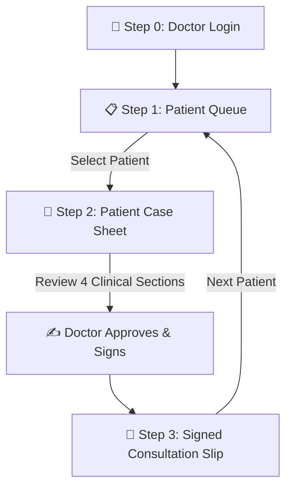
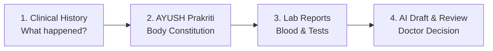

# 🩺 MediKiosk Doctor Portal — Easy Code & Workflow Guide
> **Written for Smart Students, Curious Beginners & Presentation Champs!**  
> *"Explain how doctors and AI work together like a superhero team to help sick patients faster!"*

---

## 🌟 1. The Big Picture: What is this Project?

Imagine walking into a busy hospital. There are 50 patients waiting in line. The doctor is tired, looking through thick paper files, and writing by hand with a pen. It takes 20 minutes just to understand what is wrong with one person!

**MediKiosk fixes this!**
1. An **AI Kiosk** at the hospital entrance asks the patient questions first (in their own language like Hindi or English), measures their vitals (Blood Pressure, Heart Rate, Oxygen), and reads their lab reports.
2. The **Doctor Portal (Our Code)** is the **Doctor's Super Computer**. 
3. When the doctor sits at their desk, all the patient's information is already neatly arranged, sorted, and color-coded. The doctor can review everything in **30 seconds** instead of 20 minutes!

---

## 🗺️ 2. The Doctor's Journey: Step-by-Step Workflow

Think of the application as a **3-level video game** where the doctor helps patients:



---

### 🔑 Step 0: The Doctor's ID Badge (`LoginPage.jsx`)
* **What happens:** Before seeing any patients, the doctor must sign in.
* **Who can log in?**
  * **Dr. Anand Kulkarni** (AYUSH / Ayurveda Specialist — OPD Room #14)
  * **Dr. Rajesh Sharma** (Allopathic / Modern Medicine Specialist — OPD Room #104)
* **What the code does:** When you click a doctor's name, the app remembers: *"Aha! Dr. Anand is in the room!"* and opens his personalized clinic.

---

### 📋 Step 1: The Patient Waiting Room (`PatientListPage.jsx`)
* **What happens:** The doctor sees all the patients waiting in line.
* **The "Fire Alarm" (Emergency Red Flags):**
  * If a patient has dangerous vitals (like very high blood pressure or chest pain), the card turns **flashing red** with a flame icon: `🔥 EMERGENCY: CRITICAL CARDIOVASCULAR TRIAGE`.
  * This tells the doctor: *"Stop! See this patient right now before anyone else!"*
* **The Search & Filters:** The doctor can type a name or filter by *"Waiting"*, *"In Consultation"*, or *"Red Flags"*.
* **Click to Open:** Clicking any patient opens their full folder (Step 2).

---

### 📂 Step 2: The Investigation Room (`PatientDetailPage.jsx`)
This is the heart of the app. It divides medical knowledge into **4 easy sections**:



1. **Section 1: Clinical History & Review of Systems (ROS)**
   * Tells the story of the illness: What hurts? For how long?
   * Shows past medical history and drug allergies (e.g. *"Allergic to Penicillin"*).
2. **Section 2: AYUSH Prakriti & Assessment (`AyushAssessmentCard.jsx`)**
   * Based on traditional Indian Ayurveda science (Ministry of Ayush).
   * Calculates the patient's **Dosha balance** (Vata 35%, Pitta 55%, Kapha 10%).
   * Shows the **Ashtavidha Pariksha** (8-fold examination: Tongue, Pulse, Eyes, Voice, etc.).
3. **Section 3: Extracted Lab Reports**
   * Shows blood tests read by AI OCR (Optical Character Recognition).
   * If a value is dangerously high (like Cardiac Troponin), it gets a red **`HIGH`** badge.
   * If it's safe, it gets a green **`NORMAL`** badge.
4. **Section 4: AI Summary & Doctor Review (`SummaryActionToolbar.jsx`)**
   * The AI writes a neat draft summary note of everything.
   * The doctor has **3 super-powers**:
     1. ✏️ **Amend / Edit**: Change any words if the AI made a mistake.
     2. ❌ **Reject Draft**: Throw it out if not accurate.
     3. ✅ **Accept & Sign Off**: Stamp it with their official doctor signature!

---

### 📜 Step 3: The Golden Certificate (`SignedConsultationView.jsx`)
* **What happens:** The consultation is complete!
* **The Official OPD Slip:**
  * Displays the official token number (e.g., `EM-101`).
  * Shows the doctor's name, OPD room, and timestamp.
  * Links to **ABHA / ABDM** (Ayushman Bharat Digital Mission — India's national health system).
  * Lists prescribed Ayurvedic medicines (like *Avipattikar Churna*) and foods to eat (*Pathya*) vs foods to avoid (*Apathya*).
* **Print Button:** The doctor can print the slip for the patient.
* **Next Patient Button:** Takes the doctor right back to the queue for the next patient!

---

## 💻 3. How the React Code Works (Explained with Toy Analogies)

### 🧱 1. Components are LEGO Bricks
In React, each part of the screen is a separate file called a **Component**. You build the screen by stacking them together:

| Component File | Real Life Analogy | What it does |
| --- | --- | --- |
| [App.jsx](file:///d:/sih/patient-case-taking/frontend/doctor/src/App.jsx) | **The Movie Director** | Controls the whole show. Decides whether to show the Login screen, the Queue, or the Case Sheet. |
| [LoginPage.jsx](file:///d:/sih/patient-case-taking/frontend/doctor/src/components/LoginPage.jsx) | **The Security Guard** | Lets Dr. Anand or Dr. Rajesh log in with their PIN. |
| [Header.jsx](file:///d:/sih/patient-case-taking/frontend/doctor/src/components/Header.jsx) | **The Doctor's Smartwatch** | Sits at the top. Shows live clock, waiting count, alert count, doctor badge, and theme switch. |
| [PatientListPage.jsx](file:///d:/sih/patient-case-taking/frontend/doctor/src/components/PatientListPage.jsx) | **The Waiting Room Screen** | Lists all patients with tokens, age, emergency flags, and search bar. |
| [PatientDetailPage.jsx](file:///d:/sih/patient-case-taking/frontend/doctor/src/components/PatientDetailPage.jsx) | **The Medical Clip-Board** | The big 4-section view with history, vitals, labs, and review. |
| [AyushAssessmentCard.jsx](file:///d:/sih/patient-case-taking/frontend/doctor/src/components/AyushAssessmentCard.jsx) | **The Ayurveda Dosha Meter** | Shows the Pitta-Vata-Kapha meters and 8-point exam cards. |
| [SummaryActionToolbar.jsx](file:///d:/sih/patient-case-taking/frontend/doctor/src/components/SummaryActionToolbar.jsx) | **The Doctor's Rubber Stamp** | Has the Edit, Reject, and Accept & Sign-Off buttons. |
| [SignedConsultationView.jsx](file:///d:/sih/patient-case-taking/frontend/doctor/src/components/SignedConsultationView.jsx) | **The Printed Certificate** | Shows the final completed case slip with ABDM ID and medicine plan. |

---

### 🧠 2. What is `useState`? (The Magic Whiteboard)
Computers forget things immediately unless you write them down on a whiteboard. In React, that whiteboard is called **State** (`useState`):

```javascript
// 1. Who is logged in right now? (Starts as empty / null)
const [currentDoctor, setCurrentDoctor] = useState(null);

// 2. Which patient is the doctor looking at?
const [selectedPatientId, setSelectedPatientId] = useState(null);

// 3. Which room / step are we in? (1 = Queue, 2 = Case Sheet, 3 = Signed Slip)
const [currentStep, setCurrentStep] = useState(1);

// 4. Is the screen in Dark Mode or Light Mode?
const [theme, setTheme] = useState('dark');
```
* When `currentDoctor === null` &rarr; React shows the **Login Screen**.
* When the doctor logs in &rarr; React wipes the whiteboard, sets `currentDoctor = Dr. Anand`, and shows **Step 1 (Patient Queue)**!
* When the doctor clicks a patient &rarr; `currentStep` changes to **2**, and React displays the **Case Sheet**!

---

### 🎒 3. What are `props`? (Passing Backpacks)
When a parent component wants to share information with a child component, it puts the data into a backpack called **`props`**:

```jsx
// App.jsx gives the backpack to Header.jsx:
<Header 
  currentDoctor={currentDoctor}       // "Here is the doctor's name!"
  waitingPatientsCount={3}            // "Here is how many are waiting!"
  activeRedFlagsCount={1}             // "Here is the red flag count!"
  onLogout={handleLogout}             // "Here is what to do if they log out!"
/>
```

---

## 🎨 4. Day & Night Mode (Theme Magic)

Doctors work both during bright sunny days and late night emergency shifts:
* 🌙 **Dark Mode (`slate-950`)**: Saves eyes at night. Dark sleek background with glowing cyan and neon alerts.
* ☀️ **Light Mode (`slate-50`)**: Clean hospital-grade white paper look with deep crimson (`#9f1239`) for emergency alerts and deep teal (`#0e7490`) for text so everything has **maximum readability**.

In [index.css](file:///d:/sih/patient-case-taking/frontend/doctor/src/index.css), whenever the user taps the Sun/Moon button, the class `light` or `dark` is added to the page, instantly switching the color palette!

---

## 🎤 5. The 60-Second Presentation Pitch (Cheat Sheet for Judges & Teachers)

If your teacher or a hackathon judge asks: **"Tell me about your project!"**, say this with a big smile:

> *"Hello! Our project is **MediKiosk**, an AI-assisted clinical consultation console designed for the **Ministry of Ayush** and modern hospitals.*
>
> *Normally, doctors spend 15 to 20 minutes typing and searching through paperwork. Our platform solves this in **3 simple steps**:*
> 1. *First, the doctor signs into their secure portal.*
> 2. *Second, they see a smart triage queue where high-priority emergency cases are highlighted with pulsing red flags so critical patients get immediate attention.*
> 3. *Third, opening a patient gives a comprehensive 30-second case sheet combining **modern clinical history**, **standardized AYUSH Prakriti dosha assessment**, and **OCR-extracted lab reports**.*
> 4. *Finally, the doctor reviews the AI-synthesized draft, digitally signs it with ABDM compliance, and generates an official consultation prescription.*
>
> *Everything is fully responsive, works on mobiles and desktops, and supports both high-contrast light and dark modes!"*

---

## 🏆 Summary Checklist of What We Built

- [x] **Secure Doctor Login** with 1-click profiles for AYUSH and Allopathic doctors.
- [x] **Smart Triage Queue** with live count badges and red-flag emergency detection.
- [x] **4-Section Case Sheet** covering History, AYUSH Prakriti, Lab tests, and AI note.
- [x] **Doctor Decision Controls** to Amend, Reject, or Digitally Sign the consultation.
- [x] **ABDM-Compliant Case Slip** with official token, prescription, and print capability.
- [x] **Day & Night Themes** with WCAG-compliant high-contrast medical color palettes.
- [x] **Mobile Responsive** with touch-friendly buttons on phones, tablets, and desktops.
